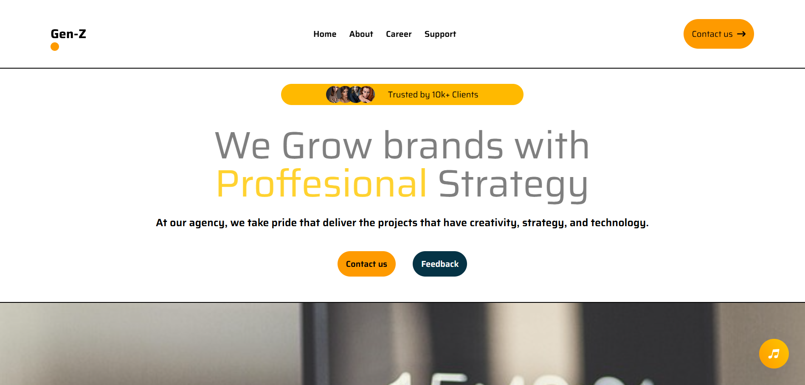
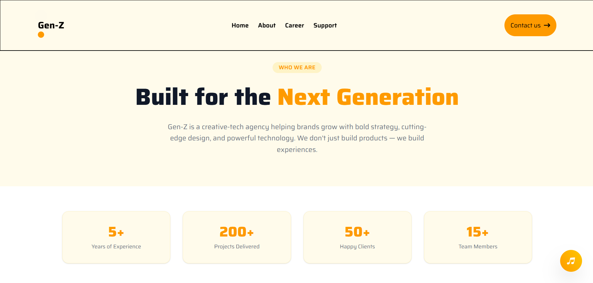
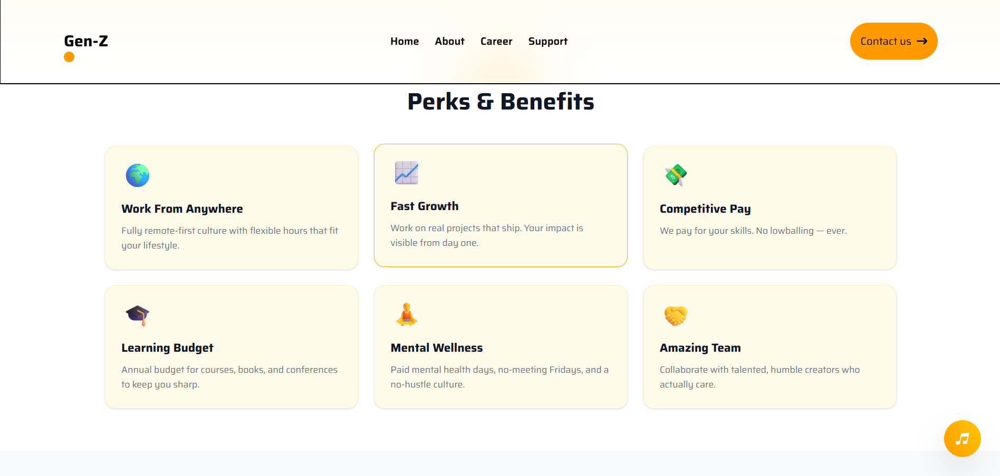
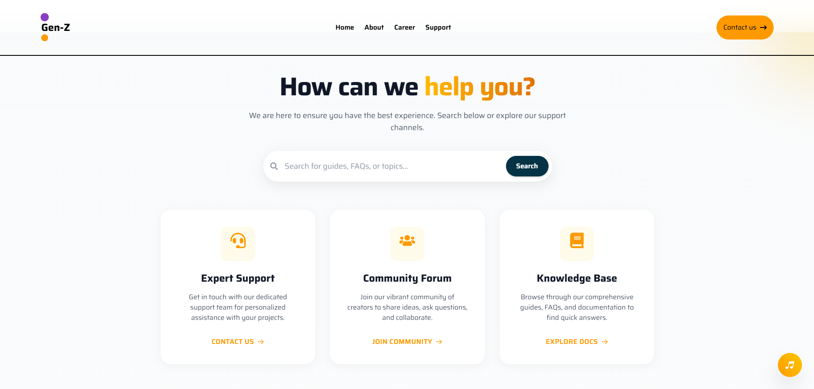
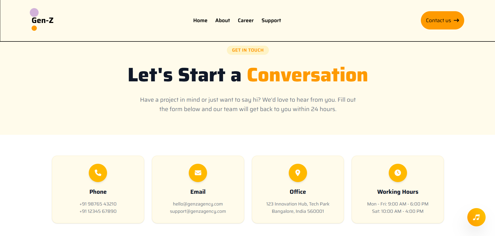
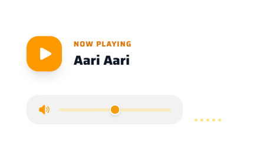

# Gen-Z — Creative-Tech Agency Website

> **Helping brands grow with strategy, creativity, and technology.**

A modern, fully responsive agency website built with **React 19**, **Vite 7**, and **Tailwind CSS v4**. Gen-Z is a creative-tech agency platform showcasing services, team, portfolio, career opportunities, and multi-channel support — all wrapped in a polished, performant UI.

---

## Table of Contents

- [Features](#features)
- [Tech Stack](#tech-stack)
- [Project Structure](#project-structure)
- [Getting Started](#getting-started)
- [Available Scripts](#available-scripts)
- [Pages & Routing](#pages--routing)
- [Components](#components)
- [Key Highlights](#key-highlights)
- [Services Offered](#services-offered)
- [Screenshots Preview](#screenshots-preview)
- [Contributing](#contributing)
- [License](#license)

---

## Features

### Home Page
- **Hero Section** — Bold headline, trust badge ("Trusted by 10k+ Clients"), overlapping profile avatars, and dual CTA buttons
- **Partner Logos** — Animated brand icons (Microsoft, Twitter, WhatsApp, YouTube, GitHub, Git, Amazon) with hover color transitions
- **Services Grid** — Four core services with icons, titles, and descriptions in a responsive 2-column layout
- **Team Showcase** — 8 team member cards with profile images, names, and designations
- **Portfolio/Work Gallery** — 6 project cards with hover zoom and lift animations

### About Page
- Agency story and philosophy ("Creativity meets Code")
- Stats dashboard (5+ years, 200+ projects, 50+ clients, 15+ team members)
- Core values: Innovation First, Client Partnership, Results Driven, Creative Excellence
- Team spotlight with emoji avatars
- Call-to-action section

### Career Page
- Perks & benefits grid (remote-first, fast growth, competitive pay, learning budget, mental wellness, amazing team)
- 4 current job openings with tags, type, location, and one-click apply
- Open application CTA for roles not listed

### Support Page
- Full-text search bar for guides and FAQs
- 3 support channels: Expert Support, Community Forum, Knowledge Base
- "Support Our Growth" section with tiered contribution options (Coffee, Pizza Fund, Feature Sponsor)
- FAQ accordion with common questions
- Contact form with success state
- Contact details (email, phone, location)

### Contact Page
- 4 info cards: Phone, Email, Office, Working Hours
- **Formik + Yup** validated contact form (name, email, phone, subject, message)
- Form submissions stored in `localStorage`
- Real-time validation with error messages
- CTA section with direct email link

### Global Features
- **Floating Audio Player** — Magnetic cursor effect, glass-morphism expand card, volume slider, mini visualizer, play/pause with animated bars
- **Responsive Navigation** — Desktop links + mobile hamburger menu with slide-in panel
- **Consistent Footer** — Quick links, services list, newsletter subscription, branding

---

## Tech Stack

| Category        | Technology                           |
|-----------------|--------------------------------------|
| **Framework**   | React 19                             |
| **Build Tool**  | Vite 7                               |
| **Styling**     | Tailwind CSS v4                      |
| **Routing**     | React Router DOM v7                  |
| **Form Mgmt**   | Formik + Yup                         |
| **Icons**       | React Icons (Fa, Hi)                 |
| **Font**        | Saira (Google Fonts)                 |
| **Linting**     | ESLint 9 + react-hooks + react-refresh |

---

## Project Structure

```
Gen-Z/
├── index.html                      # Entry HTML file
├── package.json                    # Dependencies & scripts
├── vite.config.js                  # Vite configuration
├── eslint.config.js                # ESLint rules
├── src/
│   ├── main.jsx                    # React root + BrowserRouter
│   ├── App.jsx                     # Route definitions
│   ├── index.css                   # Global styles + Tailwind import
│   ├── assets/
│   │   └── assets.js               # Image imports, teams, services, workItems data
│   ├── components/
│   │   ├── Nav.jsx                 # Responsive navbar with mobile menu
│   │   ├── Hero.jsx                # Landing hero section
│   │   ├── Partner.jsx             # Trusted partner brand logos
│   │   ├── Container.jsx           # Services grid display
│   │   ├── Team.jsx                # Team member cards
│   │   ├── Work.jsx                # Portfolio/project cards
│   │   ├── Footer.jsx              # Site-wide footer
│   │   └── FloatingAudioPlayer.jsx # Interactive audio player widget
│   └── pages/
│       ├── Home.jsx                # Landing page (assembles hero → footer)
│       ├── About.jsx               # About the agency
│       ├── Carrer.jsx              # Career opportunities
│       ├── Support.jsx             # Help center + support form
│       └── Contact.jsx             # Contact form with validation
└── public/
    └── bg-music.mp3                # Background audio for floating player
```

---

## Getting Started

### Prerequisites

- **Node.js** ≥ 18
- **npm** (or yarn / pnpm)

### Installation

```bash
# Clone or navigate to the project directory
cd Gen-Z

# Install dependencies
npm install

# Start the development server
npm run dev
```

The app will be available at `http://localhost:5173` (or the port Vite assigns).

### Build for Production

```bash
npm run build
```

Output goes to the `dist/` folder — ready for deployment on Vercel, Netlify, GitHub Pages, or any static host.

### Preview Production Build

```bash
npm run preview
```

---

## Available Scripts

| Command           | Description                              |
|-------------------|------------------------------------------|
| `npm run dev`     | Start Vite dev server with HMR           |
| `npm run build`   | Build for production                     |
| `npm run preview` | Preview the production build locally     |
| `npm run lint`    | Run ESLint to check code quality         |

---

## Pages & Routing

| Route       | Component    | Description                        |
|-------------|--------------|------------------------------------|
| `/`         | `Home`       | Landing page with all sections     |
| `/about`    | `About`      | Agency story, values, team, stats  |
| `/carrer`   | `Career`     | Job openings, perks, apply         |
| `/support`  | `Support`    | Help center, FAQ, contact form     |
| `/contact`  | `Contact`    | Contact info + validated form      |

---

## Components

| Component                | Purpose                                          |
|--------------------------|--------------------------------------------------|
| `Nav`                    | Fixed top navbar with desktop links + mobile hamburger menu |
| `Hero`                   | Hero banner with headline, trust badge, CTAs, hero image |
| `Partner`                | Row of trusted partner brand logos with hover effects |
| `Container`              | Services grid (Web Dev, Graphic Design, Digital Marketing, Mobile Apps) |
| `Team`                   | Team member photo cards with name and designation |
| `Work`                   | Portfolio project showcase cards |
| `Footer`                 | Multi-column footer with links, services, newsletter |
| `FloatingAudioPlayer`    | Bottom-right audio widget with magnetic cursor, glass card, volume control, visualizer |

---

## Key Highlights

### Floating Audio Player
A standout feature — a floating bubble in the bottom-right corner that:
- **Attracts** toward your cursor with a magnetic effect
- **Expands** into a glass-morphism control card on hover
- Shows **animated equalizer bars** when playing
- Includes a **volume slider** with custom styling
- Displays error state if `bg-music.mp3` is missing
- Plays on loop with play/pause toggle

### Form Validation (Contact Page)
The contact form uses **Formik** for state management and **Yup** for schema validation:
- Name: 2–50 characters, required
- Email: valid format, required
- Phone: 10–15 digits with allowed characters, required
- Subject: 5–100 characters, required
- Message: 10–500 characters, required
- Submissions saved to `localStorage`

### Responsive Design
Every page and component is fully responsive:
- Mobile-first approach with Tailwind breakpoints (`sm`, `md`, `lg`, `xl`)
- Hamburger menu for mobile navigation
- Grid layouts that collapse gracefully on smaller screens

### Design System
- **Primary Color**: Amber/Yellow (`amber-400`, `amber-500`)
- **Accent**: Cyan dark (`cyan-950`)
- **Font**: Saira (Google Fonts) — clean, modern sans-serif
- **Custom Theme**: `--color-primary: #ffcb05`, `--color-dark: #363732`

---

## Services Offered

| # | Service                  | Icon       | Description                                              |
|---|--------------------------|------------|----------------------------------------------------------|
| 1 | Web Development          | `FaCode`   | Fast, responsive, user-friendly websites                 |
| 2 | Graphic Design           | `FaPaintBrush` | Eye-catching brand visuals and design              |
| 3 | Digital Marketing        | `FaBullhorn` | Strategic online presence growth                   |
| 4 | Mobile App Development   | `FaMobileAlt` | Functional, high-performance mobile apps            |

---

## Screenshots Preview

> *Add your own screenshots here by placing images in a `screenshots/` folder and updating the paths below.*

| Home Page | About Page |
|-----------|------------|
|  |  |

| Career Page | Support Page |
|-------------|--------------|
|  |  |

| Contact Page | Audio Player |
|--------------|--------------|
|  |  |

---

## Contributing

Contributions are welcome! Here's how you can help:

1. **Fork** the repository
2. Create a **feature branch** (`git checkout -b feature/amazing-feature`)
3. **Commit** your changes (`git commit -m 'Add amazing feature'`)
4. **Push** to the branch (`git push origin feature/amazing-feature`)
5. Open a **Pull Request**

### Guidelines
- Follow the existing code style and component structure
- Use Tailwind utility classes for styling
- Keep components focused and reusable
- Test on multiple screen sizes before submitting

---

## Deployment

This project can be deployed to any static hosting platform:

### Vercel
```bash
npm install -g vercel
vercel
```

### Netlify
```bash
npm run build
# Drag the dist/ folder to Netlify's deploy page
```

### GitHub Pages
```bash
npm install -g gh-pages
npm run build
gh-pages -d dist
```

---

## License

This project is open source and available under the [MIT License](LICENSE).

---

<div align="center">

**Built with ❤️ using React, Vite & Tailwind CSS**

*Gen-Z — Where Creativity Meets Code*

</div>
